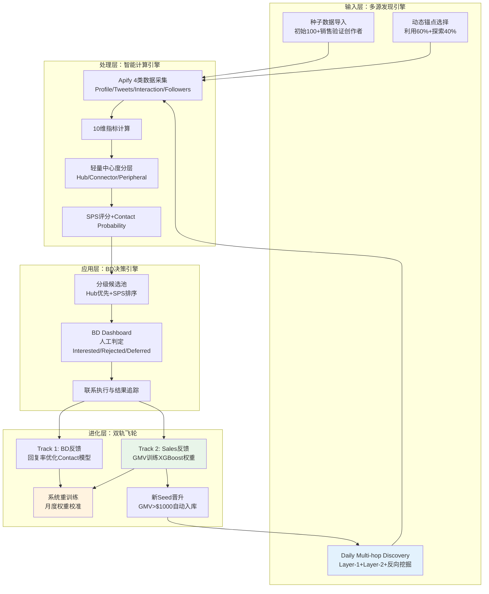

# CraftifyX Miner 6.0 — 全栈创作者发现与进化系统（docx 原文转换）

> **来源文件**：`CraftifyX Miner 6.0.docx`  
> **转换说明**：由 `.docx` 经 macOS `textutil` 导出文本后整理为 Markdown；代码块与表格已按可读性重排。

---

### User

将上述CraftifyX Miner 5.6.1以CraftifyX Miner 5.6 为核心基础，输出一份更为完整的CraftifyX Miner 6.0给我，需要有包含种子数据导入到最终飞轮的完整的业务流程，完整度不低于5.6系统

### Kimi / 文档正文

基于 CraftifyX Miner 5.6 核心架构，融入 5.6.1关键改进（Multi-hop Discovery、反向挖掘、动态锚点、轻量中心度），构建完整生产级系统 CraftifyX Miner 6.0。

🎯 CraftifyX Miner 6.0 - 全栈创作者发现与进化系统
系统定位：从种子数据导入到飞轮进化的端到端解决方案，7×24小时持续发现，双轨驱动进化，1人技术团队可运维。

🏗️ 系统架构 6.0：三层飞轮 + 双轨进化



📋 完整业务流程：从种子到飞轮

## Phase 1: 种子数据导入（Week 1）

输入：您现有的 `merged_creators.csv`（含销售数据、分类标签）

```sql
-- Step 1: 导入初始种子
COPY creators(username, total_sales, category, cart_rate, has_merch_experience)
FROM 'merged_creators.csv' CSV HEADER;

-- Step 2: 标记种子层级（基于真实销售数据）
UPDATE creators SET
    is_seed = true,
    seed_tier = CASE
        WHEN total_sales > 2000 OR cart_rate > 0.12 THEN 'S'
        WHEN total_sales > 500 THEN 'A'
        WHEN total_sales > 100 THEN 'B'
        ELSE 'C'
    END,
    discovered_via = 'initial_import';
```

输出：100 个分级种子（Tier S:8 人, A:15, B:35, C:42，文档示例）

## Phase 2: 初始 Graph 构建（Week 2）

目标：基于 100 个种子，构建 Layer-1 网络（约 5,000 人）

```python
# 流程：Seed Following 抓取 → 去重过滤 → 深度采集 → 入库

class InitialGraphBuilder:
    def execute(self):
        # 1. 抓取100个Seed的Following（各500人）
        for seed in get_all_seeds():
            following = apify.crawl_following(seed, max_items=500)
            
            # 2. 过滤条件
            qualified = [
                f for f in following 
                if 1000 < f['followers'] < 100000  # 有效创作者范围
                and not is_existing_creator(f)      # 去重
                and not is_bot(f)                   # 排除机器人
            ]
            
            # 3. 标记发现关系
            for creator in qualified:
                creator['discovered_via'] = 'layer_1'
                creator['anchor_seed'] = seed['username']
                creator['connection_type'] = 'follow'
                
            batch_insert(creators_table, qualified)
            
        # 4. 构建Graph关系表
        build_creator_graph_relations()
```

产出：`creators` 表约 5,000 个 Layer-1 候选人；`creator_graph` 表约 100×500 = 50,000 条关系边。

## Phase 3: 每日 Multi-hop Discovery（持续运转）

核心改进（融合 5.6.1）：

```python
class DailyDiscoveryEngine:
    def run(self):
        # === Layer-1: 常规扩展（60%预算）===
        seeds = select_dynamic_anchors()  # 动态锚点选择
        layer1_candidates = self.crawl_layer(seeds, max_items=500)
        
        # === Layer-2: 超级连接器挖掘（30%预算）===
        super_connectors = identify_super_connectors(min_seed_connections=3)
        layer2_candidates = self.crawl_layer(super_connectors, max_items=200)
        
        # === 反向挖掘：Seed的创作者粉丝（10%预算，每周2次）===
        if is_reverse_mining_day():
            reverse_candidates = self.crawl_reverse_followers()
            candidates = merge_priority(reverse_candidates, layer2_candidates, layer1_candidates)
        else:
            candidates = merge_priority(layer2_candidates, layer1_candidates)
        
        # === 深度采集与计算 ===
        self.deep_process(candidates)
        self.generate_daily_report()
    
    def select_dynamic_anchors(self):
        """动态锚点：60%利用 + 40%探索"""
        anchors = []
        
        # 60% 利用：高GMV Seed（已知有效）
        high_gmv = query("""
            SELECT username FROM creators 
            WHERE seed_tier IN ('S', 'A')
            ORDER BY last_used_as_anchor ASC
            LIMIT 12
        """)
        anchors.extend(high_gmv)
        
        # 40% 探索：高SPS但未成交（潜力验证）
        unexplored = query("""
            SELECT username FROM creator_scores cs
            JOIN creators c ON cs.creator_id = c.id
            WHERE cs.sps_score > 80 
            AND c.total_sales IS NULL  -- 无销售记录
            ORDER BY RANDOM()
            LIMIT 8
        """)
        anchors.extend(unexplored)
        
        return anchors
    
    def identify_super_connectors(self):
        """识别被多个Seed关注的创作者（圈层核心）"""
        return query("""
            SELECT connected_creator_id as username, COUNT(*) as centrality
            FROM creator_graph 
            WHERE connection_type = 'follow'
            GROUP BY connected_creator_id
            HAVING COUNT(*) >= 3
            ORDER BY centrality DESC
            LIMIT 20
        """)
    
    def crawl_reverse_followers(self):
        """反向挖掘：抓取Tier_S Seed的Followers中的创作者"""
        tier_s_followers = apify.crawl_followers(tier_s_seeds, max_items=1000)
        
        # 筛选其中的创作者（Bio关键词 + 粉丝1k-50k）
        creator_followers = [
            f for f in tier_s_followers
            if has_creator_keywords(f['bio']) 
            and 1000 < f['followers'] < 50000
        ]
        
        return creator_followers
```

产出：每日 500–800 个新候选人（Layer-2 优先处理）。

## Phase 4: 10 维指标与中心度计算（自动）

流程：深度采集 → 特征计算 → 中心度分层 → SPS 评分

```python
class FeatureCalculationPipeline:
    def process_batch(self, candidates):
        for creator in candidates:
            # 1. 基础指标（来自Apify数据）
            metrics = {
                'audience_score': calculate_audience(creator['followers']),
                'engagement_score': calculate_engagement(creator['tweets']),
                'virality_score': calculate_virality(creator['tweets']),
                'posting_score': calculate_posting(creator['tweets']),
                'monetization_score': calculate_monetization(creator['bio']),
                'growth_score': calculate_growth(creator),
                'fan_creator_ratio': calculate_fan_ratio(creator['followers_sample']),
                'character_consistency': calculate_character_phash(creator['tweets']),
                'community_score': calculate_community(creator['tweets']),
                'data_confidence': calculate_confidence(creator)
            }
            
            # 2. 轻量中心度分层（SQL查询，无需复杂Graph算法）
            centrality = self.calculate_centrality_tier(creator['username'])
            
            # 3. SPS评分（类型特定权重）
            creator_type = classify_creator_type(creator['bio'])
            sps = calculate_sps(metrics, creator_type)
            
            # 4. Contact Probability预测
            contact_prob = predict_contact_success(creator, metrics)
            
            # 5. 入库
            insert_creator_features(creator['id'], metrics)
            insert_creator_scores(creator['id'], creator_type, sps, contact_prob, centrality)
    
    def calculate_centrality_tier(self, username):
        """轻量中心度：基于共同关注Seed数量"""
        seed_connections = query(f"""
            SELECT COUNT(DISTINCT creator_id) as count
            FROM creator_graph
            WHERE connected_creator_id = '{username}'
            AND creator_id IN (SELECT id FROM creators WHERE is_seed = true)
        """)[0]['count']
        
        if seed_connections >= 5:
            return 'Hub'  # 被多个Seed认可，圈层核心
        elif seed_connections >= 2:
            return 'Connector'  # 连接节点
        else:
            return 'Peripheral'  # 边缘节点
```

## Phase 5: BD Dashboard 决策流程（人机结合）

BD 每日工作流：

**早 9:00 — 查看日报**
  今日新候选: 687人
  Hub级高优先级: 15人 (被≥5个Seed关注)
  Connector级: 42人
  按SPS>75筛选: 68人
  
  操作: 点击[查看Hub级优先]

早9:30-11:30 - 人工判定:
  对每个候选人:
    1. 查看X主页 (外链)
    2. 查看10维雷达图 (系统生成)
    3. 查看相似Seed案例 (如"相似于@roronekorone 87%")
    4. 做出判定:
       - [Interested] → 进入联系队列，记录原因
       - [Rejected] → 记录原因(类型不符/造假/风险)
       - [Deferred] → 暂缓，30天后重新评估

下午2:00-5:00 - 联系执行:
  对标记Interested的创作者:
    - 通过Email/DM联系 (手动，系统提供参考话术)
    - 记录contact结果到outreach_log表
Dashboard界面关键元素：
候选人卡片:
  - 头像 @username [链接X主页]
  - 中心度标签: 🔴 Hub / 🟡 Connector / ⚪ Peripheral
  - SPS分数: 86/100 (排序依据)
  - 创作者类型: 原创OC (权重已应用)
  - 10维雷达图: [可视化]
  - 关键信号:
      ✅ has_merch_experience (Bio含shop)
      ✅ 美国受众>40% (基于历史统计)
      ✅ Virality: 8.5x (爆款体质)
  - 相似于: @eden (相似度0.87，GMV $28k)
  - 发现来源: 通过@komodo关注 (Layer-2挖掘)
  - Contact Probability: 78% [高]
  
  操作按钮: [Interested] [Rejected] [Deferred] [详情]

## Phase 6: 双轨飞轮进化（月度）

### Track 1: BD 反馈优化（联系成功率）

```python
def monthly_contact_model_update():
    """基于BD联系结果，优化Contact Probability预测"""
    data = query("""
        SELECT 
            cs.contact_probability as predicted,
            CASE WHEN o.response_received THEN 1 ELSE 0 END as actual,
            cf.monetization_score,
            cf.community_score,
            cf.data_confidence
        FROM outreach_log o
        JOIN creator_scores cs ON o.creator_id = cs.creator_id
        JOIN creator_features cf ON o.creator_id = cf.creator_id
        WHERE o.contacted_at >= CURRENT_DATE - INTERVAL '30 days'
    """)
    
    # 训练逻辑回归模型
    model = LogisticRegression().fit(
        data[['monetization_score', 'community_score', 'data_confidence']], 
        data['actual']
    )
    
    # 更新预测模型参数
    update_contact_prediction_model(model)
    
    # 生成洞察报告
    generate_insight("下月Contact Probability准确度预计提升至82%")
```

### Track 2: Sales 反馈优化（SPS 权重）

```python
def monthly_sps_calibration():
    """基于实际销售数据，校准SPS权重"""
    sales_data = query("""
        SELECT cf.*, sf.gmv, cs.creator_type
        FROM sales_feedback sf
        JOIN creator_features cf ON sf.creator_id = cf.creator_id
        JOIN creator_scores cs ON sf.creator_id = cs.creator_id
        WHERE sf.launch_date >= CURRENT_DATE - INTERVAL '30 days'
    """)
    
    # 按创作者类型分别训练XGBoost
    for creator_type in ['oc_creator', 'vtuber', 'fan_artist', 'game_creator', 'content_creator']:
        type_data = sales_data[sales_data['creator_type'] == creator_type]
        
        if len(type_data) < 10:
            continue  # 数据不足，跳过
            
        model = XGBRegressor().fit(
            type_data[['audience_score', 'engagement_score', 'virality_score', 
                      'character_consistency', 'monetization_score', 'fan_creator_ratio']],
            type_data['gmv']
        )
        
        # 提取特征重要性，更新权重配置
        importance = dict(zip(features, model.feature_importances_))
        update_sps_weights(creator_type, importance)
        
        print(f"{creator_type} 权重已更新: {importance}")
    
    # 新Seed自动晋升
    new_seeds = sales_data[sales_data['gmv'] > 1000]
    for _, creator in new_seeds.iterrows():
        promote_to_seed(
            creator_id=creator['creator_id'],
            tier='C',
            source='sales_proven',
            gmv=creator['gmv']
        )
```

🛠️ 技术实现架构

### Apify 工具配置（4 类数据）

| 数据类别 | Actor | 调用频率 | 输入配置 | 成本 |
|----------|-------|----------|----------|------|
| Profile | apidojo/twitter-profile-scraper | 每日批量 500 人 | `{"handles": [...], "includeMetrics": true}` | $3/1000 |
| Tweets | apidojo/twitter-scraper | 每日批量 500 人 | `{"maxTweets": 50, "includeReplies": false}` | $3/1000 |
| Following | apidojo/twitter-following | 每日 20 锚点×500 | `{"maxItems": 500}` | $2/1000 |
| Followers | apidojo/twitter-followers | 每周 2 次×1000 | `{"maxItems": 1000}` | $2/1000 |

日成本：$10–15（月 $300–450，文档口径）。

### 数据库 Schema（完整 6+1 表）

```sql
-- 1. creators（主档案）
CREATE TABLE creators (
    id SERIAL PRIMARY KEY,
    username TEXT UNIQUE NOT NULL,
    followers INTEGER,
    following INTEGER,
    tweets_count INTEGER,
    bio TEXT,
    website TEXT,
    account_age INTEGER,
    -- 种子标记
    is_seed BOOLEAN DEFAULT false,
    seed_tier VARCHAR(5), -- S/A/B/C
    total_sales FLOAT DEFAULT 0, -- 累计GMV
    has_merch_experience BOOLEAN,
    -- 发现溯源
    discovered_date DATE DEFAULT CURRENT_DATE,
    discovered_via VARCHAR(50), -- initial_import/layer_1/layer_2/reverse_mining
    anchor_seed TEXT,
    -- BD工作流
    bd_status VARCHAR(20) DEFAULT 'pending',
    bd_assigned_to VARCHAR(50),
    bd_decision VARCHAR(20),
    bd_decision_note TEXT,
    last_bd_update TIMESTAMP,
    first_seen_at TIMESTAMP DEFAULT NOW()
);

-- 2. tweets（推文数据）
CREATE TABLE tweets (
    id SERIAL PRIMARY KEY,
    tweet_id TEXT UNIQUE,
    creator_id INTEGER REFERENCES creators(id),
    likes INTEGER,
    retweets INTEGER,
    replies INTEGER,
    views INTEGER,
    created_at TIMESTAMP,
    text TEXT,
    media_urls TEXT[],
    interaction_data JSONB, -- 存储who retweeted/replied
    collected_at TIMESTAMP DEFAULT NOW()
);

-- 3. creator_features（10维指标）
CREATE TABLE creator_features (
    id SERIAL PRIMARY KEY,
    creator_id INTEGER REFERENCES creators(id),
    calculated_at TIMESTAMP DEFAULT NOW(),
    audience_score FLOAT,
    engagement_score FLOAT,
    virality_score FLOAT,
    growth_score FLOAT,
    posting_score FLOAT,
    monetization_score FLOAT,
    fan_creator_ratio FLOAT,
    character_consistency FLOAT,
    community_score FLOAT,
    data_confidence FLOAT
);

-- 4. creator_graph（关系图谱）
CREATE TABLE creator_graph (
    id SERIAL PRIMARY KEY,
    creator_id INTEGER REFERENCES creators(id),
    connected_creator_id INTEGER REFERENCES creators(id),
    connection_type VARCHAR(20), -- follow/retweet/mention
    weight FLOAT DEFAULT 1.0,
    created_at TIMESTAMP DEFAULT NOW()
);

-- 5. creator_scores（SPS评分+中心度）
CREATE TABLE creator_scores (
    id SERIAL PRIMARY KEY,
    creator_id INTEGER REFERENCES creators(id),
    creator_type VARCHAR(20),
    sps_score FLOAT,
    confidence FLOAT,
    -- 轻量中心度
    centrality_tier VARCHAR(20), -- Hub/Connector/Peripheral
    seed_connections INTEGER, -- 被多少Seed关注
    -- Contact Prediction
    contact_probability FLOAT,
    predicted_response_rate FLOAT,
    updated_at TIMESTAMP DEFAULT NOW()
);

-- 6. sales_feedback（系统进化核心）
CREATE TABLE sales_feedback (
    id SERIAL PRIMARY KEY,
    creator_id INTEGER REFERENCES creators(id),
    sku_id TEXT,
    gmv FLOAT,
    units_sold INTEGER,
    launch_date DATE,
    conversion_rate FLOAT,
    bd_contact_id INTEGER,
    days_to_close INTEGER,
    created_at TIMESTAMP DEFAULT NOW()
);

-- 7. outreach_log（BD联系追踪）
CREATE TABLE outreach_log (
    id SERIAL PRIMARY KEY,
    creator_id INTEGER REFERENCES creators(id),
    bd_username VARCHAR(50),
    contact_channel VARCHAR(20), -- email/dm
    contacted_at TIMESTAMP,
    response_received BOOLEAN,
    response_time_hours INTEGER,
    deal_status VARCHAR(20), -- negotiating/closed/declined/no_response
    notes TEXT,
    created_at TIMESTAMP DEFAULT NOW()
);
```

核心代码结构

```
project/
├── config/
│   ├── apify_config.yaml      # Apify Actor配置
│   └── weights.yaml           # 5类创作者SPS权重
├── pipeline/
│   ├── seed_import.py         # Phase 1: 种子导入
│   ├── initial_graph.py       # Phase 2: 初始Graph构建
│   ├── daily_discovery.py     # Phase 3: 每日Multi-hop发现
│   ├── feature_engine.py      # Phase 4: 10维指标计算
│   └── evolution.py           # Phase 6: 双轨进化
├── dashboard/
│   └── app.py                 # Streamlit BD Dashboard
├── models/
│   ├── contact_predictor.pkl  # Contact Probability模型
│   └── sps_weights.json       # 动态SPS权重
└── cron/
    └── daily_job.py           # 定时任务入口
```

## 📅 6 周实施路线图

| 周次 | 阶段 | 关键任务 | 产出 |
|------|------|----------|------|
| Week 1 | 种子导入 | 部署 PostgreSQL；导入 merged_creators.csv；标记 Tier S/A/B/C | 100 个分级种子就绪 |
| Week 2 | 初始 Graph | 配置 Apify 4 Actor；抓取 100 Seed Following；构建 ~5,000 人 Layer-1 | creator_graph 约 5 万条关系 |
| Week 3 | 指标计算 | Feature Engine；100 Seed 10 维指标；初始 SPS 权重 | Seed 特征库完成 |
| Week 4 | Dashboard | Streamlit；BD 工作流；outreach_log | BD 可人工判定 |
| Week 5 | Daily Discovery | Multi-hop 自动化；动态锚点；Layer-2 | 每日发现 500–800 人 |
| Week 6 | 飞轮启动 | 首月 Sales；权重校准；新 Seed 晋升 | 双轨进化运转 |

## 💰 成本与产出估算（文档口径）

**月度成本（稳定期）**：Apify 订阅 $49；每日采集约 $300（Layer-1 $5 + Layer-2 $3 + 反向 $2）×30；PostgreSQL $25；服务器 $20；OpenAI API $20（Bio 分类辅助）；**总计约 $414/月**。

**月度产出**：自动发现约 15,000 人；进入 BD 审核约 450 人（SPS>75 Top 3%）；BD 实际联系约 150 人；预计成交 15–30 人；新增 Seed 10–15 人（GMV>$1000）。

**ROI（示例）**：客单价假设 $5,000 → 月度 GMV 增量约 $75,000–$150,000；系统成本占比约 0.5%。

## 🎯 6.0 vs 5.6 核心改进总结

| 维度 | 5.6 原版 | 6.0 完整版 | 价值 |
|------|----------|------------|------|
| 发现深度 | 仅 Layer-1 | Layer-1+Layer-2+反向 | 发现量 +40%，触达圈层核心 |
| 锚点策略 | 固定轮换 | 动态 60% 利用 + 40% 探索 | 减少同质化 |
| 中心度 | 无 | Hub/Connector/Peripheral | BD 优先高价值目标 |
| 业务流程 | 偏技术架构 | 种子到飞轮完整 SOP | 可执行手册 |
| 进化机制 | 概念描述 | 双轨可运行代码 | 月度自优化 |
CraftifyX Miner 6.0 是一个从数据导入到飞轮进化、从代码实现到业务SOP、从日度发现到月度进化的完整闭环系统，1人技术团队即可支撑月均15,000创作者发现、450人BD审核、15-30人成交的业务规模。