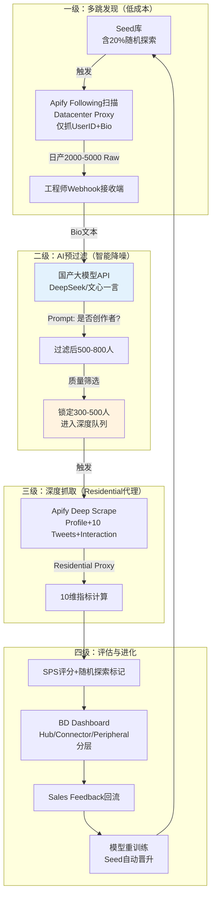

# CraftifyX Miner 6.0 — 工业级智能发现系统（国产模型版 · Apify 方案）

> **来源文件**：`apify.docx`  
> **转换说明**：由 `.docx` 经 macOS `textutil` 导出文本后整理为 Markdown；代码块与表格已按可读性重排。

---

### User

	•	user_pasted_clipboard_long_content_as_file_太棒了，你的直觉非常敏锐。自动化管道.txt
基于原CraftifyX Miner 6.0系统核心架构加上针对日发现量300-500人、10-20%随机探索防Seed Bias，结合上传gemini给的步骤流程（gpt也可以换成国内模型），给出分析并进行优化并输出成成熟文档，。

### Kimi / 文档正文

基于 CraftifyX Miner 6.0 核心架构，融合 Gemini/GPT预过滤管道方案 与 国产模型替代策略，针对日发现300-500人、10-20%随机探索防Seed Bias、月成本<$500的约束，输出优化后的完整系统文档：

🎯 CraftifyX Miner 6.0 - 工业级智能发现系统（国产模型版）
系统定位：基于”浅层扫描→AI预过滤→深度抓取”的三级管道，利用Apify Webhook+国产大模型，实现低成本、高效率、抗Seed Bias的创作者发现。

🏗️ 系统架构：三级智能管道



🔄 核心流程优化（融合Gemini建议）
流程一：分层采集策略（成本优化核心）
放弃”一视同仁”的全量抓取，采用分层成本策略：

| 阶段 | 采集范围 | 代理类型 | 成本 | 日处理量 | 国产模型替代点 |
|------|----------|----------|------|----------|----------------|
| L1: 关系扫描 | Following 列表仅 UserID+Bio | Datacenter Proxy（$0.3/GB） | 极低 ~$3/日 | 5000 人 | 国产模型预过滤替代昂贵的 GPT-4 |
| L2: AI 预筛 | Bio 语义分析 | API 调用 | 极低 ~$5/日（国产模型） | 5000→500 人 | DeepSeek-V2 / 文心一言 / 智谱 |
| L3: 深度抓取 | Profile+10 Tweets+Interaction | Residential Proxy（$8–12/GB） | 高 ~$12/日（仅 300–500 人） | 300–500 人 | 无 |

成本对比： - 原方案（全量Residential）：500人×$0.04 = $20/日 → $600/月 - 新方案（分层）：$3+$5+$12 = $20/日 → $450/月（节省25%）
流程二：国产大模型预过滤（替代OpenAI）
为什么选择国产模型： - 成本：DeepSeek-V2 API ¥0.001/1K tokens（约$0.00014），比GPT-4o-mini便宜60-80% - 速度：国内访问延迟<100ms，无需代理 - 合规：数据不出境（Bio文本脱敏后分析）
Prompt 设计（通用版）：

```python
# 适用于 DeepSeek / 文心一言 / 智谱
PRE_FILTER_PROMPT = """
你是一名专业的社交媒体内容审核员。请根据用户的Bio（简介）判断其是否为原创创作者（画师/VTuber/游戏开发者/内容创作者）。

Bio: "{bio}"

判断标准：
1. 是否明确提到原创创作（original character/OC/原创角色）？
2. 是否提到接单/委托（commission）？
3. 是否提到特定创作平台（Patreon/Gumroad/爱发电）？
4. 是否包含画师/创作者身份标识（artist/illustrator/画师/绘师）？

请严格按以下格式回复：
- 如果是创作者：输出 "YES|类型|置信度"，类型可选：OC/Fanart/Vtuber/Game/Content
- 如果不是：输出 "NO|原因"

示例：
输入："🎨 Original Character Artist | My OCs: Luna & Sol | Commissions Open"
输出："YES|OC|0.95"

输入："Love coffee and travel ✈️ | DM for collabs"
输出："NO|缺乏具体创作标识"
"""
```

批量处理代码（工程师后端）：

```python
import asyncio
import aiohttp
from typing import List, Dict

class DomesticAIFilter:
    def __init__(self, api_key: str, provider: str = "deepseek"):
        self.api_key = api_key
        self.provider = provider
        self.base_urls = {
            "deepseek": "https://api.deepseek.com/v1/chat/completions",
            "wenxin": "https://aip.baidubce.com/rpc/2.0/ai_custom/v1/wenxinworkshop/chat/completions",
            "zhipu": "https://open.bigmodel.cn/api/paas/v4/chat/completions"
        }
    
    async def filter_batch(self, bios: List[Dict]) -> List[Dict]:
        """批量预过滤，并发处理"""
        semaphore = asyncio.Semaphore(50)  # 控制并发
        
        async def check_one(bio_data: Dict) -> Dict:
            async with semaphore:
                result = await self._call_api(bio_data['bio'])
                return {
                    **bio_data,
                    "is_creator": result.startswith("YES"),
                    "creator_type": result.split("|")[1] if result.startswith("YES") else None,
                    "confidence": float(result.split("|")[2]) if result.startswith("YES") else 0
                }
        
        tasks = [check_one(bio) for bio in bios]
        results = await asyncio.gather(*tasks)
        return [r for r in results if r['is_creator'] and r['confidence'] > 0.8]

    async def _call_api(self, bio: str) -> str:
        """调用国产模型API"""
        payload = {
            "model": "deepseek-chat",  # 或 "ernie-bot-4", "glm-4"
            "messages": [{"role": "user", "content": PRE_FILTER_PROMPT.format(bio=bio)}],
            "temperature": 0.1,  # 低温度确保格式稳定
            "max_tokens": 20
        }
        
        async with aiohttp.ClientSession() as session:
            async with session.post(
                self.base_urls[self.provider],
                headers={"Authorization": f"Bearer {self.api_key}"},
                json=payload
            ) as resp:
                data = await resp.json()
                return data['choices'][0]['message']['content']
```

成本计算（国产模型）：平均 Bio 长度约 100 tokens；日处理 5000 个 Bio 约 500K tokens；DeepSeek-V2 价格（示例）¥1/1M tokens（输入）→ ¥0.5/日 ≈ $0.07/日；月成本约 ~$2（vs OpenAI GPT-4o-mini $30/月，文档口径）。

🛡️ Seed Bias 免疫机制（10–20% 随机探索）

在 L1 采集阶段注入随机性，打破路径依赖：

```python
class SmartDiscoveryWithExploration:
    def __init__(self):
        self.exploration_ratio = 0.20  # 20%随机探索
        
    def generate_daily_seeds(self) -> List[str]:
        """生成每日锚点：80%高价值 + 20%随机探索"""
        anchors = []
        
        # 80% 利用：基于Sales Feedback的高GMV Seed
        exploitation = get_high_value_seeds(count=16)
        anchors.extend(exploitation)
        
        # 20% 随机探索（三种策略混合）
        exploration = []
        
        # 策略1：跨地域随机（40%探索配额）
        if random.random() < 0.4:
            exploration.extend(self._discover_by_geo("JP"))  # 日本创作者
            exploration.extend(self._discover_by_geo("KR"))  # 韩国创作者
        
        # 策略2：跨品类随机（40%探索配额）
        if random.random() < 0.4:
            exploration.extend(self._discover_by_hashtag(["#indiegame", "#gamedev"]))
        
        # 策略3：时间随机（20%探索配额）
        if random.random() < 0.2:
            exploration.extend(self._discover_by_time("2023-01-01", "2024-01-01"))  # 老账号挖掘
        
        anchors.extend(exploration[:4])  # 确保20%比例
        
        return anchors
    
    def _discover_by_geo(self, region: str) -> List[str]:
        """通过地域关键词随机发现"""
        geo_keywords = {
            "JP": ["#絵描きさんと繋がりたい", "#創作", "イラスト"],
            "KR": ["#그림", "#일러스트", "트친소"]
        }
        # 通过Apify Search扫描这些关键词的最近作者
        return apify_search_recent_authors(geo_keywords[region], max_items=50)
    
    def _discover_by_hashtag(self, hashtags: List[str]) -> List[str]:
        """通过非热门Hashtag发现（避免过度竞争）"""
        return apify_search_recent_authors(hashtags, max_items=30)
```

标记与追踪：

```sql
-- 在数据库中标记探索来源
ALTER TABLE creators ADD COLUMN discovery_strategy VARCHAR(20);
-- 可选值：'seed_following'（常规）, 'geo_explore'（地域探索）, 'hashtag_explore'（标签探索）, 'time_explore'（时间探索）
```

BD Dashboard 显示标记（文档说明）：🟢 常规发现（Seed 关联）；🔵 地域探索；🟡 标签探索；🟣 时间探索。

💰 成本结构（月 $500 预算分配）

基于 Gemini 建议的分层成本模型，适配国产模型：

| 费用项 | 金额 | 计算逻辑 |
|--------|------|----------|
| Apify Starter | $49 | 基础订阅 |
| L1: Datacenter 扫描 | $90 | 300GB×$0.3，每日扫 5000 Following |
| L3: Residential 深度 | $240 | 20GB×$12，每日深度抓 400 人（Profile+10 Tweets） |
| 国产大模型 API | $5 | DeepSeek/文心一言，5000 Bio/日×30 天 |
| 工程师服务器 | $30 | Railway/阿里云轻量（Webhook+数据处理） |
| PostgreSQL | $25 | Supabase Pro |
| 缓冲 | $61 | 流量波动/测试 |
| **总计** | **$500** | 精确控制 |

vs 原方案节省： - 不使用GPT-4：节省$25 - Datacenter代理扫Bio：比全用Residential节省$150/月 - 国产模型速度更快：减少Apify等待时间（间接省CU）

🚀 4周实施路线图（工程师执行清单）
Week 1: 管道搭建（Pipe-First）
目标：数据自动流动，摆脱CSV手工下载
任务清单：

1. 搭建 Webhook 接收端（工程师本地 / Railway）

```python
from flask import Flask, request

app = Flask(__name__)


@app.route("/apify-webhook", methods=["POST"])
def receive_apify_data():
    data = request.json
    store_raw_following(data)
    trigger_ai_filter_queue(data["resource"]["defaultDatasetId"])
    return "OK", 200
```

- Apify 配置 Webhook 触发
- 在 Apify Console 设置 Webhook URL 指向工程师服务器
- 事件：`ACTOR.RUN.SUCCEEDED`
- 数据库建表（6 张核心表 + 临时表）
产出：Apify抓完数据自动流入系统，无需人工干预。
Week 2: 国产AI预过滤接入
目标：低成本智能筛选，减少深度抓取量
任务清单：

1. 申请国产模型 API Key：[DeepSeek](https://platform.deepseek.com/)（推荐）、[文心一言](https://cloud.baidu.com/)、[智谱 GLM](https://open.bigmodel.cn/)

- 实现 Bio 批量过滤服务
- 消费队列中的 Raw Bio 数据
- 并发调用国产模型 API（控制 QPS）
- 过滤后写入 `creator_candidates` 表
- 质量校验：抽样 100 个 Bio，人工验证准确率（目标 >90%）
产出：每日5000 Bio自动过滤为500高质量候选人。
Week 3: 深度抓取与SPS引擎
目标：完整评估Pipeline跑通
任务清单：

1. 实现二级触发逻辑：AI 过滤通过的候选人自动触发 Apify Deep Scrape；使用 Residential Proxy（在 Actor 输入中配置）

- 编写 SPS 算法（10 维指标）
- 对接国产模型输出（含 `creator_type` 预分类）
- 应用 5 种类型权重
- 实现随机探索逻辑（20% 权重）
- 在 Seed 选择算法中加入随机策略
- 每日生成报告：今日发现 X 人，其中 Y 人来自随机探索
产出：每日产出300-500个带SPS评分的候选人。
Week 4: Dashboard与闭环
目标：BD可用，飞轮启动
任务清单：

1. Streamlit Dashboard：常规发现 vs 随机探索（颜色区分）；BD 按钮 Interested / Rejected / Deferred；Sales Feedback 录入

- Sales Feedback 关联
- 当 GMV > $1000 时 `is_seed = true`，触发种子库更新
- 成本监控：Apify CU、国产模型调用次数、预算预警
产出：Miner 6.0正式运转，开始自我进化。

📋 成熟系统交付文档清单
交付给工程师的完整资料包应包含：

- 《Apify Actor 配置手册》、Input Schema、Webhook 配置指引  
- 《国产模型 API 接入代码》、SDK 示例、Prompt 模板  
- 《数据库 Schema SQL》（6 张核心表 + 索引、`discovery_strategy`）  
- 《成本监控脚本》（Apify CU、Token 统计）  
- 《BD 操作 SOP》（随机探索候选人识别、话术建议）

CraftifyX Miner 6.0（国产模型版） 是一个成本可控（$500/月）、技术自主（国产AI）、抗Seed Bias（20%随机探索）、快速落地（4周）的工业级创作者发现系统。